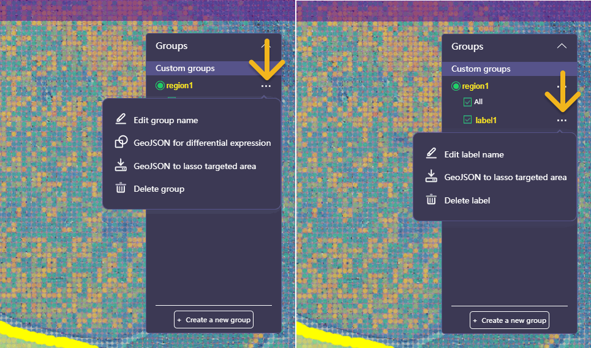

# Stereo-seq N FFPE

## Region Annotation Based on H&E Image

Spatial transcriptomics allows for the visualization and quantification of gene expression data in the context of the original tissue architecture. It generates a gene expression heatmap that characterizes the gene’s activity over the tissue. This can provide insights into the functional organization of tissues at the molecular level. On the other hand, H&E staining provides a detailed view of tissue architecture and histologic information. It allows pathologist to easily differentiate between the nuclear and cytoplasmic parts of a cell. The overall patterns of coloration from the stain show the general layout and distribution of cells.

To annotate regions of interest from tissue and extract corresponding gene expression data to gain a comprehensive understanding of both the structural and functional aspects of tissue, you may prefer to start by label on H&E image based on pathohistological features.

First, adjust the opacity of the feature expression heatmap to ensure the H&E image is visible.

<figure><figcaption></figcaption></figure> <figure><figcaption></figcaption></figure>

Following that, use the [lasso function](../navigation-for-visual-explore.md#mouse-tools) to annotate on the H&E image (similar to [Characterize Substructure and Generate New Heatmap](stereo-seq-t-ff.md#characterize-substructure-and-generate-new-heatmap)). Press **Enter** to complete the selection and click **Save** to naming the annotation.

<figure><figcaption></figcaption></figure> <figure><figcaption></figcaption></figure>

If you need a group contains multiple annotated regions, remember to label them under the identical group name.

<figure><figcaption></figcaption></figure> <figure><figcaption></figcaption></figure>

You are now able to leave the lasso mode and modify the heatmap’s opacity to view the annotations on different layers.

<figure><figcaption></figcaption></figure>

After annotation, if you would like to obtain the spatial feature expression matrix of the selected regions, click  to the right of the group or label name and choose **GeoJSON to lasso targeted area** (export `YYYYMMDDHHMMSS.lasso.geojson`). Or, if you would like to understand the differences between annotated regions, choose **GeoJSON for differential expression** (export `YYYYMMDDHHMMSS.diffexp.geojson`). See [Characterize Substructure and Generate New Heatmap](stereo-seq-t-ff.md#characterize-substructure-and-generate-new-heatmap) for details on how to pass the GeoJSON file to SAW, and see [Differential Expression Analysis](stereo-seq-t-ff.md#differential-expression-analysis) for details on the explanation of differential expression methods and how to pass the GeoJSON file to SAW.

<figure><figcaption></figcaption></figure>

## Microorganism and Host Genes

Stereo-seq N FFPE product capture total RNA information by free probe design. This design also allows for efficient capturing of microorganisms. `SAW count` pipeline for Stereo-seq N FFPE kit with argument `--micro-detect` outputs the host's spatial gene expression matrix and microorganism distribution matrix.

Open `.stereo` In StereoMap Visual Explore, microorganism distribution matrix can be accessed in layer menu under **Microorganism** category. Click  in front of the layer name to open it in a new linked window.

<figure><figcaption></figcaption></figure> <figure><figcaption></figcaption></figure>

The main window and the linked window are connected based on spot coordinates. In the main window, you can choose clusters or use lasso selection to highlight specific regions. These selected spots will then be highlighted in the linked window, along with their corresponding content.

In the example below, the main window depicts spatial clusters in bin 200, while the linked window illustrates the distribution of microorganisms in the same bin. When you choose Clusters in the main window, the linked window will exclusively display spots with corresponding coordinates. In the linked window, you can utilize the lasso function once more. Doing so will allow the statistic panel to show the components of the selected spots.

<figure><figcaption></figcaption></figure> <figure><figcaption></figcaption></figure>

Microorganisms are classified into taxonomic levels using a hierarchy followed by a double underline and the microbial species name. These levels are represented by abbreviations: p (phylum), c (class), o (order), f (family), g (genus), and s (species). For instance, the genus Mycobacterium is represented as _**g\_Mycobacterium**_ in the feature and statistics panel.
