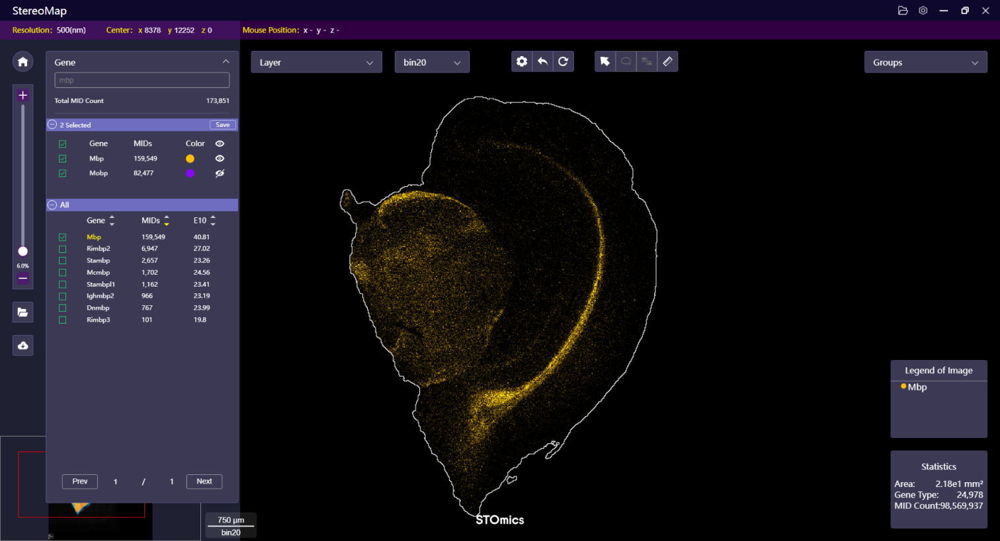
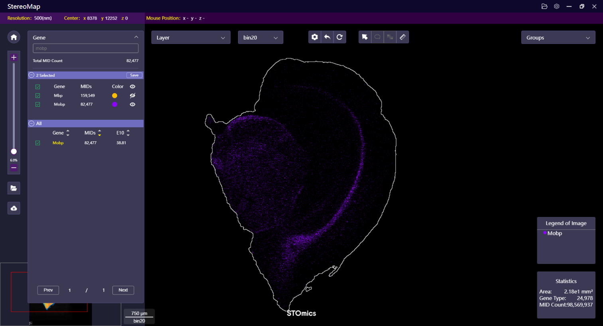
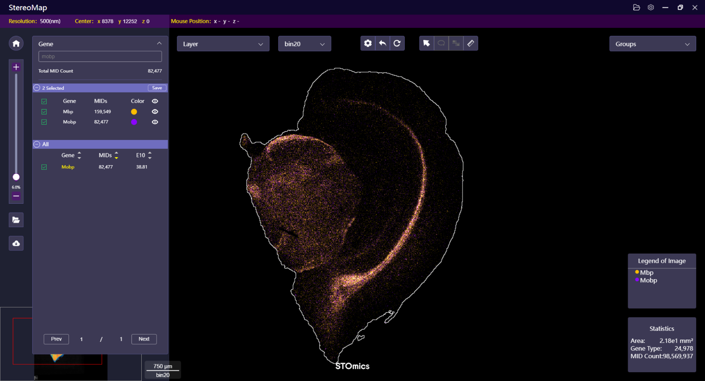

# Stereo-seq T FF

## Check Image Alignment

The tracklines on the chip surface act as markers to help with image registration. They are created when the capturing probe is unloaded and will show up as narrow lines on the spatial feature expression density heatmap. A good alignment is achieved when the tracklines perfectly overlap with the lines visible on the image. Highly recommend zooming in on the tissue edges to check the quality of the alignment.

<div><figure><figcaption></figcaption></figure> <figure><figcaption></figcaption></figure></div>

A small tip for examining alignment, begin by inspecting the two diagonal fields of view. If these views perfectly overlap, it’s likely that the overall alignment is suitable.

<figure><figcaption></figcaption></figure>

However, if most of the track lines do not overlap, you will need to realign the image manually. Refer to the [Navigation for Image Processing](../navigation-for-image-processing/) for instructions on how to do this.


If the tracklines overlap perfectly in one field of view but are mismatched in the diagonal view, it could indicate an issue due to stitching problems in your microscope image.




## Co-expression of Selected Genes

To compare the expression distribution of features, you can visualize them in different colors.

Start by selecting the interested genes, the Canvas shows a summarized expression heatmap.

<figure><figcaption></figcaption></figure>

Next, click the **Layer menu** to expand the panel and open the Gene Heatmap layer setting window. Select the **Multi-colored** option under the **Display Schemes**, you can now compare and contrast the location of the selected genes. Note that the two selected genes are not co-expressed in the tissue.

<div><figure><figcaption></figcaption></figure> <figure><figcaption></figcaption></figure></div>

If the color assigned to the gene or display setting is not optimal, click the color dot next to the selected gene to open the feature display setting window. You can change the color profile or adjust any settings.

<div><figure><figcaption></figcaption></figure> <figure><figcaption></figcaption></figure></div>

Unlike the previous selection, here we select genes that exhibit co-expression in blended colors of yellow and violet.

<div><figure><figcaption></figcaption></figure> <figure><figcaption></figcaption></figure> <figure><figcaption></figcaption></figure></div>

## Characterize Substructure and Generate New Heatmap

To identify substructure within tissue samples, the Lasso selection function can be a useful tool. You can manually delineate the regions of interest within the tissue samples. These selected regions can be scattered or continuous. The regions labeled with the same name are grouped together.

<figure><figcaption></figcaption></figure>

If you have exited lasso mode after saving the label, but realize that you need to cover another region, you can simply use the same label name to lasso select the remaining region.

<div><figure><figcaption></figcaption></figure> <figure><figcaption></figcaption></figure></div>

<div><figure><figcaption></figcaption></figure> <figure><figcaption></figcaption></figure></div>

Once the regions have been well-labeled, the coordinate information can be saved and passed to `SAW reanalyze lasso` to obtain the spatial feature expression matrix for the chosen region. Click  to the right of group or label name and choose **GeoJSON to lasso targeted area** to export the lasso GeoJSON file. Your file system will open, allowing you to choose the location to save your output `YYYYMMDDHHMMSS.lasso.geojson` file.

<div><figure><figcaption></figcaption></figure> <figure><figcaption></figcaption></figure></div>

Pass the lasso GeoJSON file path to `SAW reanalyze lasso` pipeline through the `--lasso-geojson` argument to generate the matrix of the lasso area. It is important to make the GeoJSON available to both SAW and the computing environment where the pipeline is run.


The lasso GeoJSON stores the coordinates of the region contour, rather than the spots, allowing it to be used as input for square bin or cell bin computation.


For generating new matrics in fixed-sized square bins, input `.gef` through the `--gef` argument and specify bin sizes with `--bin-size`.

```bash
saw reanalyze lasso \
--gef=/path/to/input/GEF \
--lasso-geojson=/path/to/lasso/YYYYMMDDHHMMSS.lasso.geojson \
--bin-size=1,20,50,100,200 \
--output=/path/to/output/folder
```

For exporting new matrics in cell bins, input `.cellbin.gef` through the `--cellbin-gef` argument.

```bash
saw reanalyze lasso \
--cellbin-gef=/path/to/input/cellbin/GEF \
--lasso-geojson=/path/to/lasso/YYYYMMDDHHMMSS.lasso.geojson \
--output=/path/to/output/folder
```

The newly generated matrices can be used for further analysis.

## MID Filtering

Preprocessing spatially resolved transcriptomic expression data is essential to eliminate noise before downstream analyses. The MID filtering function is specifically designed to manually remove under- or over-expressed spots of each selected feature, allowing for a focus on its spatial pattern.

The filtering function is applied to each selected feature individually, allowing for separate adjustments and different filtering thresholds. The filtering thresholds represent the lower and upper limits of the MID count and vary with bin sizes. Therefore, it is highly recommended to first switch to the intended bin size that you plan to use in the subsequent analyses before making adjustments to the MID filtering. The output matrix concatenates the filtered matrix of each feature and can be used in downstream analyses.

<div><figure><figcaption></figcaption></figure> <figure><figcaption></figcaption></figure></div>

<div><figure><figcaption></figcaption></figure> <figure><figcaption></figcaption></figure></div>

Given the limitations of compute resources, it’s highly recommended to output MID filter records as a JSON file instead of a GEF file if your dataset is generated from a [Stereo-seq Large Chip Design](https://en.stomics.tech/products/stereo-seq-transcriptomics-large-chip-design). The JSON need to be pass to `SAW reanalyze midFilter` pipeline through the `--mid-json` argument to generate the matrix.

```bash
saw reanalyze midFilter \
    --gef=/path/to/input/GEF \
    --mid-json=/path/to/MID/filtering/JSON \
    --output=/path/to/output/mid_filtering
```

## Differential Expression Analysis


New feature! Compatible with SAW >= V8.0.


Differential expression analysis is conducted on spot groups, such as clusters, or spatial regions, such as lasso labels.

For clusters, click  -> **GeoJSON for differential expression** and **Confirm** to export the necessary information passed to `SAW reanalyze diffExp` for performing computation.

<div><figure><figcaption></figcaption></figure> <figure><figcaption></figcaption></figure></div>

For lasso labels, you need first to create at least two labeled regions in a group.

<div><figure><figcaption></figcaption></figure> <figure><figcaption></figcaption></figure></div>

Then, click  located to the right of the group name and select **GeoJSON for differential expression**. In the pop-up window, select the analysis method, and click **Confirm** to export the necessary information passed to `SAW reanalyze diffExp` for performing computation. Your file system will open, allowing you to choose the location to save your output `YYYYMMDDHHMMSS.diffexp.geojson` file.

<div><figure><figcaption></figcaption></figure> <figure><figcaption></figcaption></figure></div>

Two differential expression methods are available:

* **Label vs. others:** To identify features that are differentially expressed between a specific label (cluster) and all other clusters combined.
* **Label vs. label:** To identify features that distinguish a specific label (cluster) from each other label within the same group.

<figure><figcaption></figcaption></figure>

Pass the GeoJson file path to `SAW reanalyze diffExp` pipeline through the `--diffexp-geojson` argument to generate the analysis result. It is important to make the GeoJSON available to both SAW and the computing environment where the pipeline is run.


```sh
saw reanalyze diffExp \
--count-data=/path/to/previous/SAW/count/result/folder/id \
--diffexp-geojson=/path/to/StereoMap/diffexp/YYYYMMDDHHMMSS.diffexp.geojson \
--output=/path/to/output/folder
```


SAW outputs include a `<bin_size>_marker_features.csv` file which is a formatted CSV file containing differential expression analysis result for visualization in StereoMap. Download the file to your local computer to open it in StereoMap by **Load CSV file** (see [Feature Menu](../navigation-for-visual-explore.md#feature-menu) -> **Load and Save**).

<figure><figcaption></figcaption></figure>

The differential expression analysis result table will be open in a linked new window. You can reorder the table by clicking the “up” and “down” arrows of log2 fold change (L2FC) or p-values of each gene and cluster to see the significant features.

<figure><figcaption></figcaption></figure>

Clicking on a feature name in the table will reveal the corresponding gene expression distribution on the canvas in summarized heatmap. Additionally, for multiple features, you can explore their [co-expressed relationship](stereo-seq-t-ff.md#co-expression-of-selected-genes) by showing them in multi-color mode.

<div><figure><figcaption></figcaption></figure> <figure><figcaption></figcaption></figure></div>
